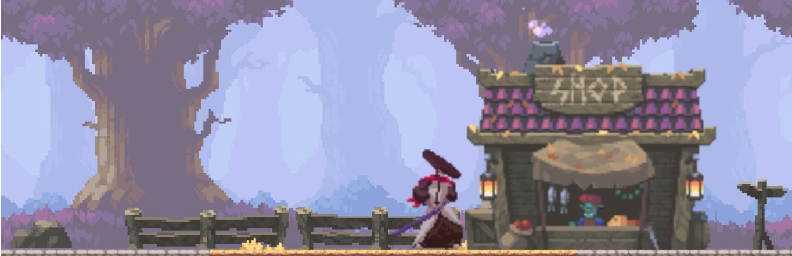

# :japanese_ogre: Kenji Battle



## Table of Contents
* [General Info](#general-info)
* [Goals](*goals)
* [Local Installation](#local-installation)
* [Tools used](#built-with)
* [Try it Out!](#try-it-out)


------

## General Info 
`Kenji Battle` was created to see if a game could be made using only HTML and JavaScript. It is a 2 player fighting game, where the players are either Samurai Mack or Kenji. They battle eachother using `AWD + SPACE` and `Arrow Keys` Respectively. This project was done along side a youtube tutorial.

## Goals
- Using only HTML Canvas and Javascript implement a  UI that displays player sprites
- Begin implementing game logic:
    - movement
    - timer
    - health
    - hit box
    - attack
    - timer
    - win conditions
- Add sprites for characters and background
- deploy the finished product

## Local Installation
```console
$ git clone https://github.com/amimbs/javascript-fight-game.git
```
- Once the repository is finished downloading, simply run index.html locally in your browser of choice.
- To modify any games sprites or images
```console
cd img
```

## Built With:
- HTML
- HTML Cnavas
- JavaScript
- [Sprites and Images](https://itch.io/)
    - [Samurai Mack](https://luizmelo.itch.io/martial-hero)
    - [Kenji](https://luizmelo.itch.io/martial-hero-2)
    - [Background](https://brullov.itch.io/oak-woods)

## Try It Out
[Kenji Battle](https://kenji-battle.netlify.app/)

https://user-images.githubusercontent.com/85318939/176017670-9859ed1e-718a-4446-b1f2-275426043a1b.mp4

<!-- <video autoplay loop muted playsinline>
<source src="./img/fightinggame.mp4" type="video/mp4">
</video> -->